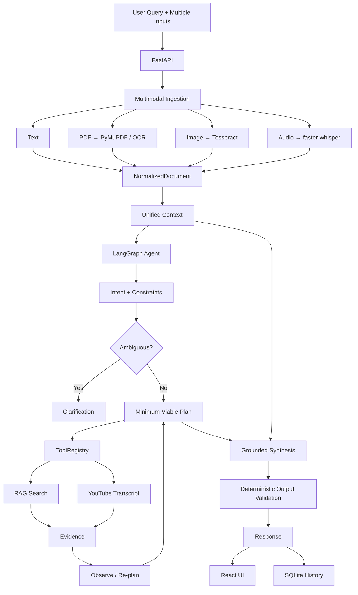

# OmniFlow — Agentic Multimodal AI Platform

**One workspace for understanding anything.**

[](https://omniflow-czkk.onrender.com)
[](#testing)
[](#deployment)
[](#local-development)

**Live application:** https://omniflow-czkk.onrender.com

## What is OmniFlow?

OmniFlow is an **agentic multimodal AI assistant** that accepts documents, images, audio, and text — individually or together — and autonomously decides how to process them.

Instead of forcing every request through the same pipeline, OmniFlow:

1. extracts and normalizes multimodal content
2. understands the user's goal and constraints
3. asks for clarification when the request is genuinely ambiguous
4. plans the minimum useful sequence of actions
5. invokes deterministic tools when needed
6. observes tool results and can re-plan
7. retrieves supporting evidence when appropriate
8. synthesizes a grounded text answer
9. exposes a safe execution trace showing what happened

The goal was not to build another chatbot with file upload — it was to build a **small, testable agent system** where the LLM makes decisions while deterministic software remains responsible for execution.

## Why OmniFlow is designed this way

The central design principle: **the LLM decides; deterministic software executes.**

LLMs are useful for semantic tasks — intent understanding, ambiguity detection, planning, semantic comparison, code explanation, sentiment reasoning, final synthesis.

They are unnecessary for deterministic operations — file validation, PDF parsing, OCR, speech-to-text, URL parsing, YouTube transcript retrieval, chunking, embeddings, vector search, input/output validation, retry and execution limits, temporary-file cleanup.

This separation gives OmniFlow three properties: **reliability** (deterministic tasks don't depend on model behavior), **explainability** (every tool invocation has a structured contract and execution trace), and **extensibility** (new tools register without rewriting the agent).

## Architecture



## Assignment scenarios

**1. Audio lecture** — Audio → speech-to-text → intent → summary. Output includes transcription, duration, summary, and requested summary formats.

**2. Meeting-notes PDF** — PDF → native extraction / OCR → intent → action-item extraction.

**3. Image of code** — Image → OCR → intent → code explanation, covering programming language, what the code does, bugs/issues, and complexity.

**4. PDF containing a YouTube URL** — PDF → reference detection → YouTube transcript → summary, with no manual copy/paste of the URL required.

**5. Audio + PDF** — Audio → transcription, PDF → extraction, both merged into a unified context → cross-source analysis. This demonstrates OmniFlow's multimodal reasoning rather than processing each file independently.

## Additional capabilities

**Cross-modal evidence & consistency** — the system explicitly classifies the relationship between sources and explains shared concepts, differences, and contradictions.

**Answer provenance** — the system exposes compact source references beneath answers, including excerpts and locators when the underlying data supports them.

These were designed to make multimodal reasoning **auditable**, rather than merely generating a final paragraph.

## Project structure

```text
OmniFlow/
├── backend/
│   ├── agents/          # cross_source, intent, planner, provenance,
│   │                     reference_resolver, synthesizer, validator
│   ├── api/              # error_handlers, routes/
│   ├── graph/
│   ├── models/
│   ├── processors/
│   ├── providers/
│   ├── rag/
│   ├── services/
│   ├── tools/
│   ├── config.py
│   ├── exceptions.py
│   ├── logging.py
│   └── main.py
├── frontend/
│   ├── src/
│   ├── public/
│   └── package.json
├── database/
│   └── .gitkeep
├── tests/
├── .env.example
├── .gitignore
├── .dockerignore
├── Dockerfile
├── pyproject.toml
├── uv.lock
└── render.yaml
```

This structure separates the major responsibilities without introducing unnecessary infrastructure layers.

## Local development

**Prerequisites:** Python 3.11+, Node.js 20+, Tesseract OCR, FFmpeg, `uv`

**Backend:**
```bash
uv sync
cp .env.example .env
# set GEMINI_API_KEY=your_real_key in .env
uv run uvicorn backend.main:app --reload --port 8000
```
Endpoints: `http://127.0.0.1:8000/health` · `http://127.0.0.1:8000/docs`

**Frontend:**
```bash
cd frontend
npm install
npm run dev
```
Open `http://localhost:5173`

## Docker

```bash
docker build -t omniflow .
docker run --rm --env-file .env -p 8000:8000 omniflow
```
Open `http://localhost:8000`

The production image builds the frontend in a Node stage, copies only the built static assets, runs FastAPI in a Python runtime image, runs as a non-root user, installs CPU-only Torch dependencies, and reads the runtime port from `$PORT`. The dependency environment is managed through `uv` and the committed `uv.lock`.

## Deployment

OmniFlow is deployed as a single Docker-based Render Web Service: GitHub → Render → Docker build → FastAPI + built React SPA.

- **Production:** https://omniflow-czkk.onrender.com
- **Health check:** `/health`
- **Required env var:** `GEMINI_API_KEY` (Render provides `PORT` automatically)

The frontend and backend share the same origin in production, so no separate frontend deployment or CORS layer is required.

## Resource-conscious design

The application was intentionally designed around free-tier constraints.

**Lazy-loaded:** Whisper · sentence-transformers · RAG indexing
**Bounded:** upload size · transcript size · document context · tool calls · agent steps · retries · synthesis correction passes

**Important limitation:** the first genuine RAG invocation loads PyTorch/sentence-transformers and can require substantially more memory than direct-context requests — this is why the embedding backend is never initialized merely because a file was uploaded. For a free Render instance, RAG is the most resource-sensitive workflow.

## UI

The interface is designed to make OmniFlow's core experience visible at a glance: multimodal input, agent activity, and cross-source reasoning.


*Main workspace with the multimodal composer, file upload, prompt suggestions, and conversation history.*


*Completed response with processed source material, safe agent activity trace, and answer provenance.*


*Audio + PDF comparison showing OmniFlow's cross-source consistency analysis, shared concepts, and differences.*

## Known limitations

**Provenance precision** — multi-page PDF RAG chunks don't currently carry exact page offsets, so page numbers are omitted when they can't be established reliably. Uploaded audio provenance doesn't expose Whisper segment timestamps.

**Session state** — the backend is request-scoped rather than a true persistent agent session. The frontend handles clarification follow-ups by composing the necessary context into the next request.

**Render free-tier resources** — RAG is substantially more memory-intensive than direct-context requests because of the embedding backend.

**External dependencies** — real Gemini and YouTube behavior depend on external service availability and quota.

## Why this project is more than a chatbot

The interesting part of OmniFlow isn't the final LLM response — it's the system around it:

Heterogeneous inputs → unified representation → intent + constraints → ambiguity handling → minimum viable planning → deterministic tools → evidence → re-planning → grounded synthesis → validated output.

The architecture deliberately keeps semantic reasoning and deterministic execution separate, making the application easier to test, easier to explain, and safer to extend.

## Future improvements

The current system intentionally stops before introducing unnecessary infrastructure. Natural next steps: deterministic URL extraction as an ingestion-level capability, precise page-level PDF provenance, preserved audio segment timestamps, persistent server-side conversations, streaming responses, cost estimation, persistent vector storage for larger corpora.

These are extensions, not prerequisites for the current application.